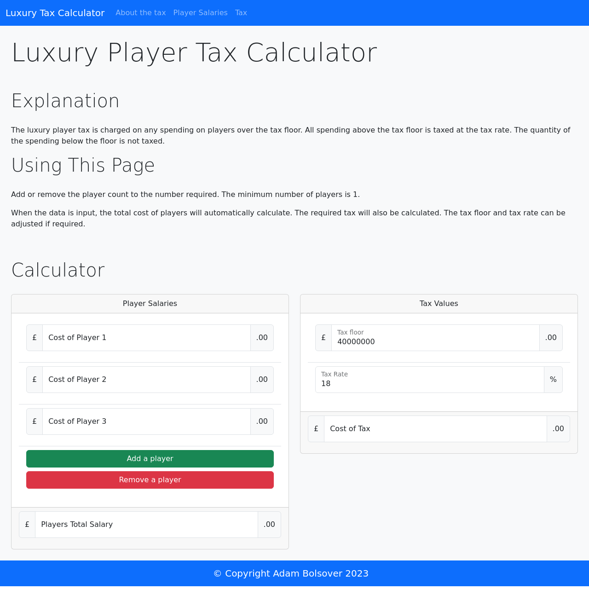

# Bootcamp Mini Project - Luxury Player Tax Calculator

## Description 

This project was created using HTML, CSS and Javascript to make a Portfolio Page. The project had the following requirements:

* As a developer, I want to write an algorithm that will calculate how much luxury tax a hypothetical sports team will pay to sign three players.
* Store salaries for each player.
* Calculate and display the total salary for all three players.
  * If the team exceeded their spending limit, calculate and display the cost of the luxury tax.
  * The team's spending limit is $40,000,000.
  * The tax rate is 18%. Note that the 18% luxury tax is only paid on the the amount of salary OVER the team's spending limit. For example, if a team's payroll is $55,000,000, they only pay luxury tax on $15,000,000.
* Receive input from a user in the browser.
* Try and hold a list of players in one variable.

The page in this repo is the result.

## Installation

The site does not require installation steps.

## Usage 

The website can be viewed at [https://bowseruk.github.io/Player-Luxury-Calculator/](https://bowseruk.github.io/Player-Luxury-Calculator/) with Google Chrome. The source can be viewed in Chrome by right clicking and selecting inspect.

## Credits

This site was based on a project by edX Boot Camps LLC.

[W3School](https://www.w3schools.com/) was used as a reference for elements to use and good practice.

The changes were checked with [W3C Validator](https://validator.w3.org/).

## License

This project uses the licence in the LICENCE file of the repo.
